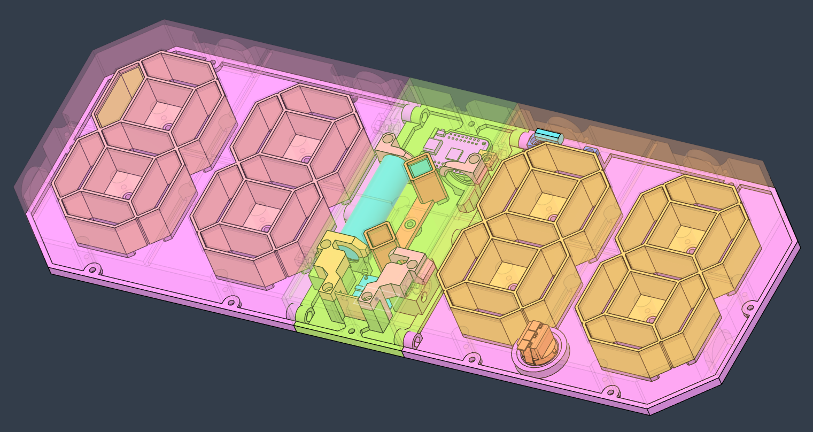

# Squash Scoreboard Display

A digital scoreboard built for squash games.  
Portable, remote-controlled way to end all memory-related (or sometimes ego-related) arguments about the current score.

## Overview
Squash Scoreboard Display is a two-sided electronic counter for tracking scores during squash matches that supports many players at once.  
It uses a large LED display for players and a smaller OLED screen on the back for configuration and audience view.  
Each player is represented by a color, so constant court side-switching is not an issue.

Main features:
- remote-controlled point counting
- color-coded player identification
- OLED display for score preview and setup
- 4-digit, 86-LED front display visible up to 20 meters  
- built-in squash scoring logic
- strong magnets allow attaching the display to any surface  
- rechargeable internal battery
- OTA updates and wireless debugging

## Motivation
We often lost track of the score during squash matches.  
Instead of arguing, I built a counter.  
It started as a fun side project — something useful, reasonably quick to build, and good-looking.  
Now it’s a part of every match. It catches the eye of other players and keeps us away from creative counting.

## Design & Concept
The project was designed around visibility and usability.  
The front display uses four large 7-segment digits made of 21 RGB LEDs each.  
The MCU has direct access to every LED, so it can render animations like Perlin noise, clouds, or fire to celebrate 
players’ actions. The rear B&W OLED provides configuration menus, player information, and a score preview for people 
outside the court. It also has two RGB side indicators, so the score can be displayed without confusion.  
The enclosure is custom designed and 3D printed from semi-transparent white PLA. 
LEDs shine through the plastic, creating a smooth, diffused surface. It was my most complex CAD design at the time.

## Hardware
| Component       | Description                                                 |
|-----------------|-------------------------------------------------------------|
| MCU             | Wemos S2 Mini (ESP32-S2)                                   |
| Display (front) | 88× WS2812B RGB LEDs (4×21 + colon + indicators)            |
| Display (rear)  | 0.96" OLED (SSD1306, 128×64)                                |
| Input           | 433 MHz remote with 4 buttons                               |
| Power           | 2× 18650 Li-Ion cells with boost converter and USB charging |
| Enclosure       | 3D-printed, semi-transparent PLA                            |
| Battery life    | ~10 hours continuous use                                    |

The device can run from battery or stay plugged in for continuous operation.

## Software
Written in C++ using PlatformIO and the Arduino framework. 
The codebase is modular, based on non-blocking state machines and timers. 
It reuses Wi-Fi, OTA, and UI modules from my 
[Pomodoro Freewire Timer](https://github.com/dabalroman/pomodoro-timer-esp32) project.

Highlights:
- implements standard squash scoring rules  
- state machines for menu and match logic
- reusable components prepared for other game types
- event-driven architecture
- OTA updates and Wi-Fi logging

## Interaction & UI
The remote provides direct control during the game.  
Functions are context-based depending on the screen state.

Basic actions:
* increment / decrement player score in a match  
* confirm / exit / toggle in menus

The front display shows the score using player colors.  
The rear OLED displays configuration, player names, and game info.  
Player scores blink when a point is scored or when the game ends.

## Future Work
* automatic matchmaking based on tournament match history  
* display tournament and per-player statistics
* web interface for match overview and data sync
* implementation of rules for other games
